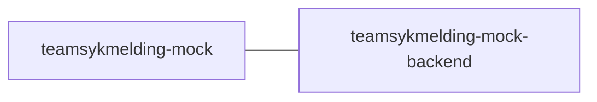

## teamsykmelding-mock

> [!WARNING]
> Dette repoet er deprekert. Mock-frontenden er slått sammen med backenden og kan finnes i repoet https://github.com/navikt/teamsykmelding-mock

Frontend app for [teamsykmelding-mock-backend](https://github.com/navikt/teamsykmelding-mock-backend)

## Technologies used

-   NEXT.js
-   Typescript
-   Yarn

#### Requirements

-   Node.js
-   npm or Yarn

## Getting Started

### install yarn

Yarn can be installed through the npm package manager, with this command:
`npm install --global yarn`

The following steps need to be in the project directory(the root foler for this app), you can run:

### Install all the dependencies

### Access to GitHub Package Registry

Since we use dependencies inherent in GPR,
then one must set up access to the GPR with a PAT (personal access token)
which has `read:packages`.
You can [create PAT here](https://github.com/settings/tokens).
If you have a PAT that you use to access maven packages in GitHub, you can reuse this.
In your `.bashrc` or `.zshrc`, set the following environment variable:

`export NPM_AUTH_TOKEN=<your PAT with read:packages>`

```bash
yarn
```

### Run the app in development mode

```bash
yarn start
```

### Builds the app for production

```bash
yarn build
```

Open http://localhost:3000/ to view it in the browser.

The page will reload if you make edits.
You will also see any lint errors in the console.

### Creating a docker image

Creating a docker image should be as simple as `docker build -t teamsykmelding-mock .`

### Running a docker image

`docker run --rm -it -p 3000:3000 teamsykmelding-mock`

## FlowChart

This the high level flow of the application



## Contact

This project is maintained by navikt/teamsykmelding

Questions and/or feature requests? Please create an [issue](https://github.com/navikt/teamsykmelding-mock/issues).

If you work in [@navikt](https://github.com/navikt) you can reach us at the Slack
channel [#team-sykmelding](https://nav-it.slack.com/archives/CMA3XV997).
